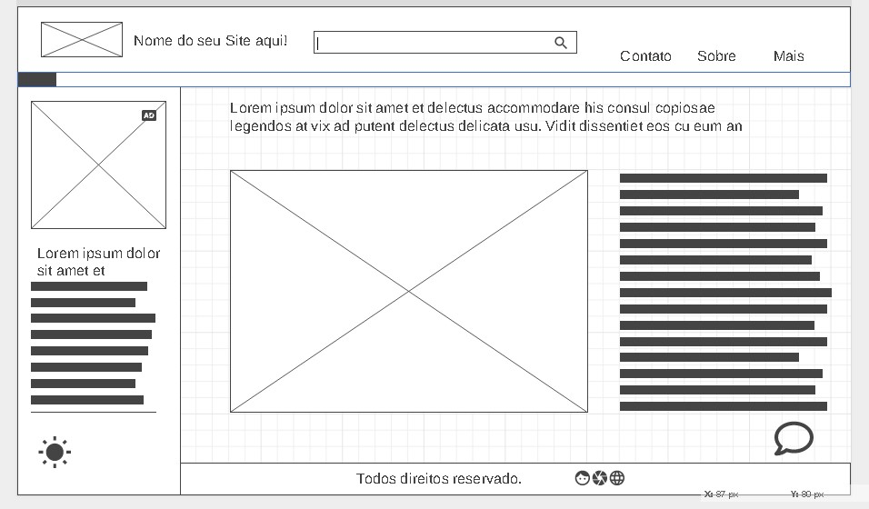

# Wireframe de média fidelidade

Esse é um wireframe de média fidelidade criado para representar a estrutura e a funcionalidade de um projeto de design. Ele oferece uma visão visual das diferentes páginas, seções e componentes que compõem o projeto.

## Objetivo

Criar um wireframe de média fidelidade como atividade prática do bootcamp de "Formação em UX Designer" da **DIO**, utilizando o GitHub como local
de hospedagem e forma de entrega das atividades propostas.
Para a criação do wireframe foi utilizado o site [wireframe.cc](https://wireframe.cc) 

## Visão Geral

O wireframe de média fidelidade é um nível intermediário de detalhamento em um projeto de design. Ele contém mais informações do que um wireframe de baixa fidelidade, mas não é tão completo quanto um protótipo de alta fidelidade. O objetivo é mostrar a estrutura do projeto, os principais elementos de conteúdo e como eles se relacionam entre si.
Componentes

O wireframe de média fidelidade inclui os seguintes componentes:

* Páginas principais: Essas são as páginas principais do projeto, como a página inicial, a página de produtos, a página de contato etc.

* Seções: Cada página principal é dividida em seções, como cabeçalho, menu, corpo do texto, rodapé etc.

* Componentes: Cada seção contém vários componentes, como botões, formulários, imagens, ícones etc.

* Fluxos de navegação: O wireframe de média fidelidade ilustra o fluxo de navegação entre as páginas e seções do projeto.

## Benefícios

O wireframe de média fidelidade é uma ferramenta importante para o processo de design. Ele oferece os seguintes benefícios:

* Ajuda a definir a estrutura e a organização do projeto.
* Ajuda a identificar e solucionar problemas de usabilidade.
* Permite que o designer e o cliente discutam e refinem as ideias do projeto.
* É fácil de criar e iterar, permitindo que o projeto seja ajustado rapidamente.

## Resultado :sparkles:

Tambem pode ser acessado diretamente por [aqui.](https://wireframe.cc/a7VNjp)

## Conclusão

O wireframe de média fidelidade é uma ferramenta valiosa para o processo de design de um projeto. Ele oferece uma representação visual da estrutura e funcionalidade do projeto, permitindo que o designer e o cliente trabalhem juntos para refinar as ideias e criar um produto final de alta qualidade.
